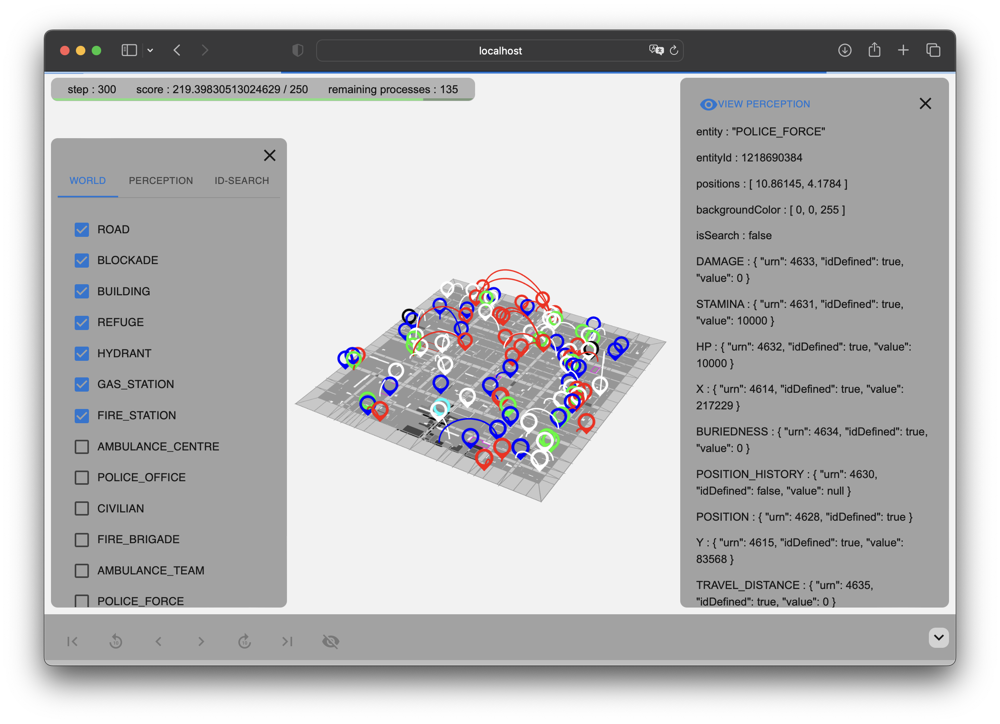

# 説明書

## 画面の構成

### ① ライナー

ステップが読み込まれている最中に表示されます．
これが表示されている間は，ステップの読み込み中であることを表します．
表示がない場合は，ステップの読み込みはおこなわれていません．

### ② ヘッダー

左から順に

-   step：現在のステップ数を表示
-   score：現在のスコアを表示
-   remaining processes：残りの読み込みステップ数を表示

となっています．

下部の緑色のバーは，スコアを表すメーターです．
スコアの減少に応じて，右から左へとメーターが減少します．

### ③ ビューワー

シミュレーションを 2 次元的に表したものを表示しています．

要素の説明

| 要素の表現              | 名称       |
| ----------------------- | ---------- |
|     | 道路       |
|    | がれき     |
|      | 市民       |
|     | 消防隊     |
|      | 救急隊     |
|      | 土木隊     |
|     | 建物       |
|  | 避難所     |
|   | 消防司令部 |
|     | 救急司令部 |
|    | 土木司令部 |

### ④ サイドバー

フィルタリングの際に使用する項目を表示しています．
また ID によってエンティティを検索することができます

### ⑤ アテンション

選択したエンティティの詳細な情報を表示しています．

### ⑥ シークバー

シミュレーションの経過ステップ数と表すバーです．
上部のボタンは，ステップ数を移動するためのものです．

## 機能と操作説明

### ③ ビューワー

#### ズームや視点移動

ズームや移動などをおこなうことができます．操作方法は以下の通りです．

| 機能               | トラックパッドでの操作                                      | マウスでの操作                                                       |
| ------------------ | ----------------------------------------------------------- | -------------------------------------------------------------------- |
| 拡大・縮小         | 2 本指を縦方向に動かす                                      | ホイールを使用                                                       |
| 上下左右に移動     | 1 本指でホールドし任意の方向へ移動する                      | マウスの左ボタンをホールドし任意の方向へ移動する                     |
| 視点に角度をつける | shift を押しながら 1 本指でホールドし 任意の方向へ傾ける | shift を押しながらマウスの左ボタンをホールドし 任意の方向へ傾ける |

#### 詳細表示

情報を知りたいエンティティをホバーすることで，そのエンティティに関するツールチップを表示することができます．
さらに詳細な情報を知りたい際はエンティティをクリックすることで，右側（⑤ アテンション）にそのエンティティの詳細な情報が表示されます．

### ④ サイドバー

ここでは，タブを切り替えることができます．以下は，各タブの説明です．

-   WORLD：シミュレーションの実世界の情報における構成要素が表示されています
-   PERCEPTION：エージェントの知覚情報と，通信で得た情報における構成要素が表示されています
-   ID-SEARCH：任意の ID を入力することで，それと一致する ID を持つエンティティを検索することができます

<!-- 各項目の説明 -->

### ⑤ アテンション

ビューワー上でクリックしたエンティティがエージェントであった場合，左上に「VIEW PERCEPTION」ボタンが表示されます．このボタンを押すことで，そのエージェントの知覚情報と通信により得た情報が，ビューワー上に表示されます．

「VIEW PERCEPTION」ボタンを押した後，WORLD タブ（④ サイドバー）内の項目である実世界が表示されている項目がすべて非表示になり，同時に PERCEPTION タブ（④ サイドバー）に知覚情報に関する項目が追加されます．
「VIEW PERCEPTION」ボタンによって表示された情報は，PERCEPTION タブ（④ サイドバー）より個別にレイヤーを表示非表示を切り替えることができます．

「VIEW PERCEPTION」ボタンによって表示された情報を非表示にするには，下部（⑥ シークバー）に追加された右端の「delete perception view」ボタンを押します．
そうすると，「VIEW PERCEPTION」ボタンによって表示された情報が非表示になり，シミュレーションの実世界における構成要素が表示されます．

<!-- 各項目の説明 -->

### ⑥ シークバー

下部に表示されている青色のバーをドラッグすることで，任意のステップ数まで進めることができます．
また，上部のボタンによってステップ数を進めることもできます．以下は，ボタンの説明です．
| ボタンの表現 | 名称 | 機能 |
| ----------------------- | ---------- | ---------- |
|  | go to initial step | 最初のステップまで戻ります |
|  | go to prev 10 step | 10 ステップだけ戻ります |
|  | go to prev step | 1 ステップだけ戻ります |
|  | go to next step | 1 ステップだけ進みます |
|  | go to next 10 step | 10 ステップだけ進みます |
|  | go to last step | 最後のステップまで進みます |

「VIEW PERCEPTION」ボタン（⑤ アテンション内）を押した際に，ボタンがひとつ追加されます．
これを押すと，「VIEW PERCEPTION」ボタンによって表示されていた情報が，非表示になります．

| ボタンの表現         | 名称                   | 機能                                                                  |
| -------------------- | ---------------------- | --------------------------------------------------------------------- |
|  | delete perception view | 「VIEW PERCEPTION」ボタンによって表示されていた情報が非表示になります |

## 仕様詳細

下記では，RRS の仕様を少しだけ紹介しつつ，本ビューワーでの描画方法等についてレイヤーごとに詳細に述べます

### ROAD & BUILDINGS & REFUGE & HYDRANT & GAS_STATION & FIRE_STATION & AMBULANCE_CENTRE & POLICE_OFFICE &

道路と建物はプロパティに EDGES があり，これはエッジ（線）の開始位置と終了位置がリストとして格納されています．
これらを一つ一つ結びつけることによって，建物と道路の描画を行なっています．

### BLOCKADE

瓦礫はプロパティに APEXES があり，これは apexes（頂点）の x と y が交互にリストとして格納されています．
これらを x と y で一つの頂点として，それらをつなげて描画を行なっています．

### CIVILIAN & FIRE_BRIGADE & AMBULANCE_TEAM & POLICE_FORCE

人間はプロパティに X と Y があり，これはエンティティのマップ上での重心（位置）を指すものです．
これらをマップ上に x と y で描画させています．

### POSITION_HISTORY

エージェントが移動した際に，POSITION_HISTORY というプロパティが格納されています．
これは，エージェントが移動した x と y 座標が交互に格納されているリストです．
これらを x と y で一つの頂点として，これらを線でつなげて，移動した軌跡を赤色で表現しています．

### COMMAND_PATH

エージェントが移動する際に，AK_MOVE というコマンドが発行されます．
このコマンド内には，そのエージェントが移動する道路や建物のエンティティの ID が順番にリストとして格納されています．
ここに格納されている道路や建物のエンティティの重心である X と Y のプロパティを頂点として，順番に青色の線として描画しています．
注意点として，この線はエンティティが移動する経路を示しているものではなく，移動に対して通過する建物や道路を示しているものである．
よって，ここで示されている線は通過する建物の重心を結んだ線です．
そのため，青色の線が道路や建物からはみ出して描画される場合もあります．
また，この道路や建物のエンティテ ID が格納されているリストの最初の ID はそのエンティティが移動を開始した場所の道路や建物のエンティティ ID も含まれています．
そのため，移動開始時の道路や建物も線に含まれています．
そして，描画される線はエンティティの重心を結んだ線であり，これはエンティティの現在位置と重ならないため，どの線がどのエンティティのパスかわり辛いものになります．
その解決策として，移動のパスの最初の点とエージェントの現在位置を線で結んでいます．
そのため，表示される通過予定のパスには，まるで一度もどっているかのような描画がされる場合があります．

### COMMAND_CLEAR COMMAND_CLEAR_AREA

土木隊が瓦礫を撤去する際，または撤去した際に，AK_CLEAR または AK_CLEAR_AREA というコマンドが発行されます．
AK_CLEAR には，啓開をおこなった瓦礫のエンティティ ID が格納されており，また AK_CLEAR_AREA は瓦礫の啓開を行う地点までの x と y 座標が含まれています．
AK_CLEAR が発行された場合は，その瓦礫がすでにそのステップになく，啓開が終わっています．
COMMAND_CLEAR レイヤーは，1 ステップ前にはあって現ステップにはない瓦礫の表示青色で描画しています．
COMMAND_CLEAR_AREA レイヤーは，その土木隊の位置から，その土木隊が啓開を行う地点までの x と y 座標までを青色の線で結んで描画しています．

### perception*
perceptionで始まるレイヤーは全て，「view perception」にて選択されたエンティティが実際に見た情報が描画されます
その知覚情報を見ているエンティティは水色のマークで表示されます．
また，ここでは情報は現在見ている情報だけではなく，過去に認知した情報も全て描画されます．
そのため，このデータは過去のデータも描画され，古い情報と新しい情報が含まれます．
また，ここで描画される内容は，実際にそのエージェントが行動をする前に見た情報が描画されます．
そのため，この知覚情報を見てこのエージェントは行動をしたと言え，またこの知覚情報は1ステップ古い情報であるとも言えます．
また，全エージェントは0ステップ時にマップの情報だけ渡されるため，近くしていない建物や道路などは，素の状態を認知しており，素の状態を描画しています．

### communication*
communicationから始まるレイヤーは全て，知覚情報を見ているエージェントが受信した通信が描画されます．
ROADは通信によって道路が通行可能か不可能かを示すレイヤーです．

AMBULANCE_TEAM，CIVILIAN，FIRE_BRIGADE，POLICE_FORCEは，そのエージェントがどこにいるのかを示すレイヤーです．

CENTRALIZEDは司令塔によって命令された対象を示すレイヤーです．

Targetはエージェントが移動する先をアークで示すレイヤーです．

